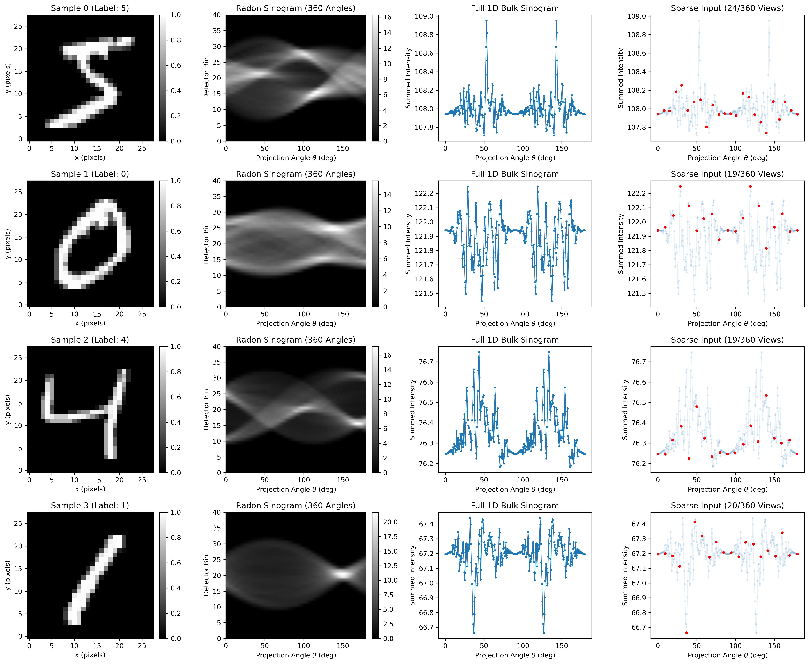

# Sparse Radon Longitudinal Pipeline: Synthetic Preprocessing Benchmark

A modular Python framework that transforms 2D image data into sparse, irregularly sampled 1D trajectories. This pipeline bridges spatial image physics with longitudinal cohort modeling, providing a controllable synthetic benchmark for trajectory clustering algorithms (e.g., modeling disease progression in axSpA clinical registries).


*Figure 1: End-to-end preprocessing workflow across four sample digits. Column 1: Ground truth MNIST image $f(x,y)$. Column 2: 2D Radon transform sinogram $\mathcal{R}f(r, \theta)$. Column 3: Fully observed 1D bulk signal $y(\theta)$. Column 4: Irregularly subsampled Poisson observations $R_{i,j} y(\theta)$ mimicking clinical visit cadences.*

---

## 📐 Problem Formulation & Physics Mapping

Longitudinal clinical studies often deal with sparse, irregular observation times across subjects. To protect patient confidentiality, we evaluate our missing-data clustering algorithm and other benchmarks on the 2D MNIST dataset, where we also convert the digits into 1D longitudinal signals via angular Radon projections and Poisson subsampling.


### 1. Forward Physics Model (Radon Transform)
For an image $f(x, y)$, the Radon transform computes line integrals along beam paths at projection angle $\theta$:

$$\mathcal{R} f(r, \theta) = \int_{-\infty}^{\infty} \int_{-\infty}^{\infty} f(x, y) \, \delta(x \cos\theta + y \sin\theta - r) \, dx \, dy$$

To create a 1D scalar response representing an aggregate longitudinal marker at time point $\theta$, we compute the total bulk projection intensity by integrating across detector bins $r$:

$$y(\theta) = \int_{\mathcal{D}} \mathcal{R} f(r, \theta) \, dr$$

### 2. Irregular Angular Sampling (Patient Visit Cadence)
Instead of observing $y(\theta)$ dense across all angles $\theta \in [0^\circ, 180^\circ)$, each subject $i$ is observed at a random, sparse subset of angles $\Theta_i = \{\theta_{i,1}, \theta_{i,2}, \dots, \theta_{i, n_i}\}$.

Observation masks $R_{i,j} \in \{0, 1\}$ are generated via Poisson-subsampled process constraints (e.g., strided or block-missingness), mimicking irregular patient clinic visit cadences where visit counts $n_i \ll N_{\text{angles}}$.

### 3. Tidy Clinical Data Contract
The output is formatted as a long-format (tidy) `DataFrame` matching clinical registry schemas (such as COMPAS/axSpA datasets):

| COMPAS_UOB_ID | response_type | angle ($\theta$) | response_value ($y$) |
| :---: | :---: | :---: | :---: |
| `0` | `"mnist"` | `0.00` | `112.45` |
| `0` | `"mnist"` | `9.23` | `113.10` |
| `1` | `"mnist"` | `4.61` | `42.80` |

* **`COMPAS_UOB_ID`**: Unique subject identifier.
* **`angle`**: Time-equivalent coordinate ($\theta$), guaranteed strictly non-decreasing per subject.
* **`response_value`**: Observed scalar bulk intensity at angle $\theta$.

---

## 🏗️ Repository Architecture
```text
src/
├── preprocessing/
│   ├── mnist_loader.py       # Computes 2D Radon forward projections
│   ├── masking.py            # Generates Poisson missingness masks (R)
│   └── dataset_builder.py    # Formats sparse projections into Tidy DataFrames
├── utils/
│   ├── tensor_ops.py         # Time-mesh alignment & missing data projections
│   └── data_mgmt.py          # Data container definitions
├── pipelines/
│   └── main_pipeline.py      # Main pipeline orchestration script
├── visualization/
│   └── plotting.py           # Diagnostic trajectory & centroid plots
└── cli.py                    # Command-line interface driver
```

## 🚀 Execution

### 1. Via CLI with Config File (Recommended)
Run the pipeline using a JSON or YAML configuration file:

```bash
python -m src.cli --config configs/default_config.yaml
```